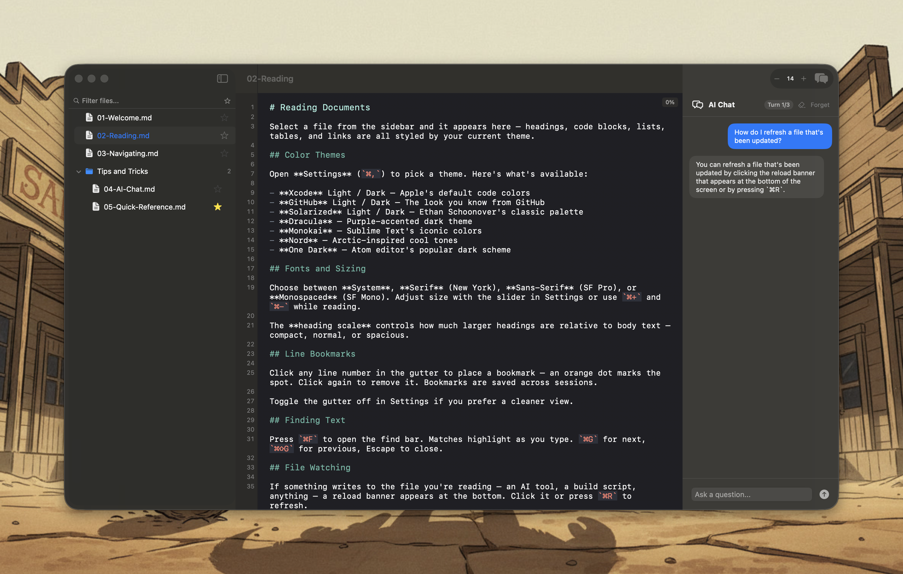

# Pixley Markdown

Read and collaborate with your AI's markdown.

AI coding tools generate specs, checklists, docs, and changelogs into your project folders. Pixley renders the interactive parts as native controls — checkboxes toggle, radio groups select, placeholders become fill-in fields, review blocks become approval buttons with timestamps. Everything writes back to the file. Next time your agent reads it, your responses are just there.

Not an editor. Not a note app. Just a pipe between you and your AI, with markdown as the shared medium.



## Use cases

Smoke test checklists, spec approvals, design reviews, sprint planning signoffs, release go/no-go decisions, feature flag configs, QA pass/fail tracking, onboarding task lists, code review action items, bug triage worksheets.

## Features

- **Interactive controls** — checkboxes, radio groups, fill-ins, status machines, review approvals, CriticMarkup comments — all rendered from standard markdown syntax
- **Folder tree sidebar** — NSOutlineView-backed file browser, handles large trees
- **Live file watching** — reload pill appears when the file changes on disk
- **Quick Switcher (Cmd+P)** — fuzzy file search
- **Syntax-highlighted rendering** — 7 theme families with light/dark variants
- **On-device AI chat** — ask questions about the current document using Apple Foundation Models (no cloud, no API keys)
- **Drag-and-drop** — drop a folder or file onto the window to open it
- **Zero external dependencies**

## Requirements

- macOS 15 (Sequoia) or later
- AI chat requires macOS 26 (Tahoe) + Apple Intelligence

## Building

```bash
open AIMDReader.xcodeproj
```

Or with Swift Package Manager:

```bash
swift build
```

## Stack

- Swift 6.2, SwiftUI + AppKit
- Apple Foundation Models (on-device LLM)
- SwiftData for metadata persistence
- No external dependencies

## License

MIT
